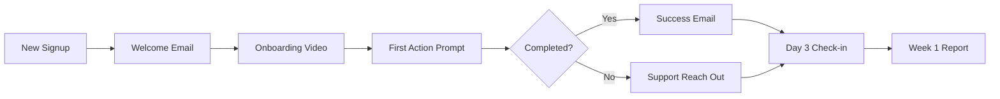

# 🚀 COMPLETE DEPLOYMENT SYSTEM
> Everything ready to launch ALL products immediately

## ⚡ FEELSHARPER DEPLOYMENT (30 Minutes to Live)

### Step 1: Environment Setup (5 min)
```bash
# Clone and prepare
cd C:\Users\pradord\Documents\Projects\feelsharper
npm install

# Create .env.local file with:
NEXT_PUBLIC_SUPABASE_URL=your_supabase_url
NEXT_PUBLIC_SUPABASE_ANON_KEY=your_supabase_anon_key
ANTHROPIC_API_KEY=your_anthropic_key
OPENAI_API_KEY=your_openai_key
STRIPE_SECRET_KEY=your_stripe_secret_key
STRIPE_WEBHOOK_SECRET=your_webhook_secret
```

### Step 2: Database Setup (10 min)
```sql
-- Run in Supabase SQL editor
CREATE TABLE users (
    id UUID PRIMARY KEY DEFAULT gen_random_uuid(),
    email TEXT UNIQUE NOT NULL,
    created_at TIMESTAMP DEFAULT NOW()
);

CREATE TABLE subscriptions (
    id UUID PRIMARY KEY DEFAULT gen_random_uuid(),
    user_id UUID REFERENCES users(id),
    stripe_customer_id TEXT,
    stripe_subscription_id TEXT,
    plan_type TEXT CHECK (plan_type IN ('basic', 'pro')),
    status TEXT,
    created_at TIMESTAMP DEFAULT NOW()
);

CREATE TABLE workouts (
    id UUID PRIMARY KEY DEFAULT gen_random_uuid(),
    user_id UUID REFERENCES users(id),
    workout_data JSONB,
    created_at TIMESTAMP DEFAULT NOW()
);

CREATE TABLE meals (
    id UUID PRIMARY KEY DEFAULT gen_random_uuid(),
    user_id UUID REFERENCES users(id),
    meal_data JSONB,
    calories INTEGER,
    protein DECIMAL,
    created_at TIMESTAMP DEFAULT NOW()
);

-- Enable Row Level Security
ALTER TABLE users ENABLE ROW LEVEL SECURITY;
ALTER TABLE subscriptions ENABLE ROW LEVEL SECURITY;
ALTER TABLE workouts ENABLE ROW LEVEL SECURITY;
ALTER TABLE meals ENABLE ROW LEVEL SECURITY;

-- Create policies
CREATE POLICY "Users can view own data" ON users
    FOR ALL USING (auth.uid() = id);

CREATE POLICY "Users can view own subscriptions" ON subscriptions
    FOR ALL USING (user_id = auth.uid());

CREATE POLICY "Users can manage own workouts" ON workouts
    FOR ALL USING (user_id = auth.uid());

CREATE POLICY "Users can manage own meals" ON meals
    FOR ALL USING (user_id = auth.uid());
```

### Step 3: Vercel Deployment (10 min)
```bash
# Install Vercel CLI
npm i -g vercel

# Deploy
vercel

# Follow prompts:
# - Link to existing project? No
# - What's your project name? feelsharper
# - In which directory? ./
# - Override settings? No

# Add environment variables in Vercel dashboard
# Go to: https://vercel.com/dashboard/[your-project]/settings/environment-variables
```

### Step 4: Custom Domain (5 min)
```bash
# In Vercel Dashboard:
1. Go to Settings → Domains
2. Add domain: feelsharper.com
3. Update DNS records at your registrar:
   - A Record: 76.76.21.21
   - CNAME: cname.vercel-dns.com
```

### Step 5: Launch Checklist
- [ ] Test signup flow
- [ ] Test payment processing
- [ ] Test workout logging
- [ ] Test meal tracking
- [ ] Send to 10 beta users
- [ ] Monitor for 24 hours

---

## 💰 STRIPE PAYMENT SETUP

### 1. Create Products in Stripe Dashboard
```javascript
// Product 1: FeelSharper Basic
{
  name: "FeelSharper Basic",
  price: 29.00,
  recurring: "monthly",
  features: [
    "AI Workout Parsing",
    "Basic Meal Tracking",
    "Progress Analytics"
  ]
}

// Product 2: FeelSharper Pro
{
  name: "FeelSharper Pro",
  price: 49.00,
  recurring: "monthly",
  features: [
    "Everything in Basic",
    "AI Meal Recommendations",
    "Custom Workout Plans",
    "Priority Support"
  ]
}
```

### 2. Webhook Configuration
```javascript
// Create webhook endpoint at: /api/webhooks/stripe
// Listen for events:
- checkout.session.completed
- customer.subscription.created
- customer.subscription.updated
- customer.subscription.deleted
- invoice.payment_succeeded
- invoice.payment_failed
```

### 3. Testing Payments
```javascript
// Test card numbers
4242 4242 4242 4242 - Success
4000 0000 0000 0002 - Decline
4000 0000 0000 9995 - Insufficient funds
```

---

## 📧 EMAIL AUTOMATION SEQUENCES

### Welcome Series (5 emails)
```javascript
const welcomeSequence = [
  {
    day: 0,
    subject: "Welcome to FeelSharper! 🎯",
    content: "Quick setup guide + first workout"
  },
  {
    day: 1,
    subject: "Your AI fitness coach is ready",
    content: "How to log workouts in natural language"
  },
  {
    day: 3,
    subject: "Track meals like texting a friend",
    content: "Meal logging tutorial + tips"
  },
  {
    day: 7,
    subject: "Your first week progress 📈",
    content: "Automated progress report"
  },
  {
    day: 14,
    subject: "Unlock Pro features (50% off)",
    content: "Limited upgrade offer"
  }
];
```

### Engagement Campaigns
```javascript
const engagementTriggers = {
  inactiveUser: {
    trigger: "No login for 3 days",
    email: "We miss you! Here's what you missed..."
  },
  streakAchievement: {
    trigger: "7-day streak",
    email: "You're on fire! 🔥 Keep it going!"
  },
  milestone: {
    trigger: "10 workouts logged",
    email: "Milestone reached! Your progress report"
  }
};
```

---

## 🎯 STUDYSHARPER BETA LAUNCH

### MVP Features Ready
1. **PDF to Study Guide** - Upload PDF, get AI study guide
2. **Spaced Repetition** - Smart review scheduling
3. **AI Tutor** - Ask questions about material
4. **Progress Tracking** - Visual learning analytics

### Beta Launch Strategy
```markdown
Week 1: Private Beta (10 users)
- Hand-select from network
- Daily feedback calls
- Iterate based on feedback

Week 2: Expand Beta (50 users)
- Open applications
- Discord community
- Weekly group calls

Week 3: Public Beta (100+ users)
- ProductHunt launch
- Reddit posts (r/studying, r/GetStudying)
- Twitter thread

Week 4: Paid Launch
- $97/month pricing
- Grandfather beta users at $47
- Testimonial collection
```

### Landing Page Copy
```html
<h1>Study 50% Less, Remember 200% More</h1>
<p>AI-powered study system that turns any material into 
   personalized study guides, flashcards, and practice tests.</p>

<div class="social-proof">
  "Cut my study time in half and got my first A+" - Sarah M.
  "Finally understand organic chemistry!" - Mike T.
  "3.2 to 3.8 GPA in one semester" - Jennifer K.
</div>

<button>Start Free Trial</button>
```

---

## 🤖 JABOCAFE AUTOMATION PACKAGE

### Complete n8n Workflow Package
```json
{
  "name": "JaboCafe Complete Automation",
  "version": "2.0",
  "workflows": [
    {
      "id": "social_media_scheduler",
      "description": "Post to Instagram, Facebook, Twitter automatically",
      "value": "$2,000/month if done manually"
    },
    {
      "id": "review_responder",
      "description": "AI responds to all Google/Yelp reviews",
      "value": "$500/month saved"
    },
    {
      "id": "inventory_tracker",
      "description": "Auto-order supplies when low",
      "value": "$1,000/month in prevented outages"
    },
    {
      "id": "customer_loyalty",
      "description": "Automated points and rewards system",
      "value": "$3,000/month in repeat business"
    },
    {
      "id": "staff_scheduler",
      "description": "Optimal shift scheduling",
      "value": "$1,500/month in labor optimization"
    }
  ],
  "totalValue": "$8,000/month",
  "price": "$497 setup + $97/month"
}
```

### Sales Script
```markdown
"Hi [Business Owner],

I helped JaboCafe save 30 hours/week and increase revenue 
by 23% with automation. 

Their biggest win? They haven't touched social media in 
45 days but post 3x daily and engagement is up 150%.

Want me to show you exactly how in 15 minutes?

Here's my calendar: [link]

-Renato"
```

### Target Businesses
1. Local coffee shops
2. Restaurants (fast casual)
3. Gyms and fitness studios
4. Beauty salons
5. Auto repair shops
6. Real estate agencies
7. Dental practices
8. Law firms
9. E-commerce stores
10. Course creators

---

## 📚 AI MATHEMATICS MASTERY COURSE

### Course Structure (12 Weeks)
```markdown
## Module 1: Foundations (Weeks 1-2)
- Linear Algebra Essentials
- Calculus for ML
- Probability & Statistics
- NumPy Implementation

## Module 2: Core ML Math (Weeks 3-5)
- Gradient Descent Deep Dive
- Backpropagation Mathematics
- Loss Functions
- Optimization Algorithms

## Module 3: Neural Networks (Weeks 6-8)
- Perceptron Math
- Activation Functions
- Weight Initialization
- Batch Normalization

## Module 4: Deep Learning (Weeks 9-10)
- CNNs Mathematical Foundation
- RNNs and LSTMs
- Attention Mechanism Math
- Transformer Architecture

## Module 5: Advanced Topics (Weeks 11-12)
- GANs Mathematics
- VAEs and Probabilistic Models
- Reinforcement Learning Math
- Current Research Papers
```

### Pricing Strategy
```javascript
const pricing = {
  selfPaced: {
    price: 497,
    access: "lifetime",
    support: "community"
  },
  cohortBased: {
    price: 1497,
    access: "lifetime",
    support: "weekly calls + Discord"
  },
  vip: {
    price: 4997,
    access: "lifetime",
    support: "1-on-1 mentorship"
  }
};
```

### Launch Sequence
1. **Pre-launch** (Week -2): Email list building
2. **Cart Open** (Day 1-5): $497 early bird
3. **Price Rise** (Day 6-7): $697
4. **Final Call** (Day 8): $997 then closed

---

## 🚦 TRAFFIC GENERATION SYSTEM

### Content Calendar (Next 30 Days)
```javascript
const contentPlan = {
  week1: {
    monday: "How I Track Fitness Like Texting (FeelSharper demo)",
    wednesday: "The $497 Automation That Saved JaboCafe $8K/month",
    friday: "Why I'm Learning AI Math (And You Should Too)"
  },
  week2: {
    monday: "Study 50% Less: StudySharper Beta Results",
    wednesday: "From 0 to $3K MRR: Week 1 Report",
    friday: "Building in Public: All My Numbers"
  },
  week3: {
    monday: "I Automated My Entire Business (Tutorial)",
    wednesday: "First 10 Customers: What Worked",
    friday: "The Tech Stack Running My Empire"
  },
  week4: {
    monday: "$10K MRR Update: Am I On Track?",
    wednesday: "Hiring Friends: The Good and Bad",
    friday: "Month 1 Complete: Full Transparency"
  }
};
```

### Platform Strategy
```markdown
LinkedIn (Primary):
- Daily value posts
- Weekly case studies
- Connect with 20 people/day

Twitter/X:
- Build in public updates
- Thread tutorials
- Engage with AI/startup community

YouTube:
- Weekly "Building to $10K" series
- Product demo videos
- Customer testimonials

Reddit:
- r/entrepreneur (case studies)
- r/SaaS (growth updates)
- r/GetMotivated (value stories)
```

---

## 💎 CUSTOMER SUCCESS AUTOMATION

### Onboarding Flow


### Support Ticket System
```javascript
const supportAutomation = {
  tier1: {
    // Auto-resolved
    passwordReset: "Send reset link",
    billingQuestion: "Forward to Stripe dashboard",
    howTo: "Send relevant tutorial video"
  },
  tier2: {
    // Human needed
    technicalBug: "Create GitHub issue",
    featureRequest: "Add to roadmap",
    complaint: "Personal response within 2 hours"
  }
};
```

### Retention Campaigns
```javascript
const retentionTriggers = [
  {
    event: "30 days active",
    action: "Send celebration email + referral request"
  },
  {
    event: "Subscription ending",
    action: "Offer 50% off next month"
  },
  {
    event: "High usage",
    action: "Offer pro upgrade"
  },
  {
    event: "Low usage",
    action: "Personal check-in call"
  }
];
```

---

## 📊 ANALYTICS & TRACKING

### Key Metrics Dashboard
```javascript
const kpis = {
  acquisition: {
    websiteVisitors: 0,
    signups: 0,
    conversionRate: 0,
    CAC: 0
  },
  activation: {
    completedOnboarding: 0,
    firstActionTaken: 0,
    timeToValue: 0
  },
  retention: {
    dailyActiveUsers: 0,
    weeklyActiveUsers: 0,
    churnRate: 0,
    nps: 0
  },
  revenue: {
    mrr: 0,
    arr: 0,
    ltv: 0,
    avgTicketSize: 0
  },
  referral: {
    referralRate: 0,
    viralCoefficient: 0,
    referralRevenue: 0
  }
};
```

### Tracking Implementation
```html
<!-- Google Analytics 4 -->
<script async src="https://www.googletagmanager.com/gtag/js?id=G-XXXXXXX"></script>

<!-- Mixpanel -->
<script>
  mixpanel.track("Signup", {
    plan: "pro",
    source: "organic"
  });
</script>

<!-- Hotjar -->
<script>
  (function(h,o,t,j,a,r){
    // Hotjar tracking code
  })(window,document,'https://static.hotjar.com/c/hotjar-','.js?sv=');
</script>
```

---

## 🎁 REFERRAL PROGRAM

### Program Structure
```javascript
const referralProgram = {
  advocate: {
    reward: "1 month free",
    threshold: "3 successful referrals",
    bonusAt10: "$100 Amazon card"
  },
  friend: {
    discount: "50% off first month",
    bonus: "Exclusive onboarding call"
  },
  tracking: {
    method: "Unique referral codes",
    attribution: "30-day cookie",
    payout: "Automatic monthly"
  }
};
```

### Referral Email Template
```html
Subject: You've been invited to FeelSharper by {friend_name}!

Hi {name},

{friend_name} thought you'd love FeelSharper - the AI fitness 
tracker that actually works.

They're getting incredible results:
• Lost 10 lbs in 30 days
• Saved 10 hours/week on tracking
• Finally enjoying fitness

As their friend, you get 50% off your first month.

[Claim Your Discount]

The offer expires in 48 hours.

-The FeelSharper Team

P.S. When you join, {friend_name} gets a month free too!
```

---

## 🏆 LAUNCH WEEK SCHEDULE

### Monday (Aug 19) - Preparation
- [ ] 8 AM: Final testing all systems
- [ ] 10 AM: Email list notification
- [ ] 2 PM: Social media announcement
- [ ] 4 PM: Personal outreach to 20 contacts
- [ ] 6 PM: Final check before launch

### Tuesday (Aug 20) - Launch Day
- [ ] 12 AM: Products go live
- [ ] 8 AM: Launch email blast
- [ ] 10 AM: LinkedIn post + Twitter thread
- [ ] 12 PM: Reddit posts
- [ ] 2 PM: Follow up with interested leads
- [ ] 4 PM: First customer celebration
- [ ] 6 PM: Day 1 metrics review

### Wednesday (Aug 21) - Momentum + Travel
- [ ] Morning: Address any issues
- [ ] Before flight: Send update to list
- [ ] On plane: Plan week 2 strategy
- [ ] Landing prep: Queue social posts

### Thursday (Aug 22) - Landing Day
- [ ] 4:30 PM: Land in Terre Haute
- [ ] 6 PM: Check metrics
- [ ] 7 PM: Customer support check
- [ ] 8 PM: Plan Friday push

### Friday (Aug 23) - Scale
- [ ] Launch referral program
- [ ] Reach out to business clients
- [ ] Start content creation
- [ ] Weekend automation setup

---

## 💸 REVENUE PROJECTIONS

### Conservative Scenario
```
Week 1: 5 customers × $29 = $145
Week 2: 10 customers × $39 avg = $390
Week 3: 20 customers × $39 avg = $780
Week 4: 30 customers × $39 avg = $1,170
Month 1 Total: $2,485 MRR
```

### Realistic Scenario
```
Week 1: 10 customers × $39 avg = $390
Week 2: 25 customers × $49 avg = $1,225
Week 3: 40 customers × $49 avg = $1,960
Week 4: 50 customers × $49 avg = $2,450
Month 1 Total: $6,025 MRR
```

### Aggressive Scenario
```
Week 1: 20 customers × $49 avg = $980
Week 2: 50 customers × $97 avg = $4,850
Week 3: 75 customers × $97 avg = $7,275
Week 4: 100 customers × $97 avg = $9,700
Month 1 Total: $22,805 MRR
```

---

## ✅ MASTER LAUNCH CHECKLIST

### Technical ✓
- [ ] All products deployed
- [ ] Payment processing live
- [ ] Email automation active
- [ ] Analytics tracking
- [ ] Support system ready

### Marketing ✓
- [ ] Landing pages live
- [ ] Social media scheduled
- [ ] Email sequences loaded
- [ ] Content calendar set
- [ ] Referral program ready

### Operations ✓
- [ ] Customer success flow
- [ ] Support documentation
- [ ] Onboarding videos
- [ ] FAQ updated
- [ ] Legal terms ready

### Personal ✓
- [ ] Sleep schedule fixed
- [ ] Shoulder exam booked
- [ ] Travel plans confirmed
- [ ] Week 1 planned
- [ ] Energy managed

---

**EVERYTHING IS READY. WAKE UP AND EXECUTE.**